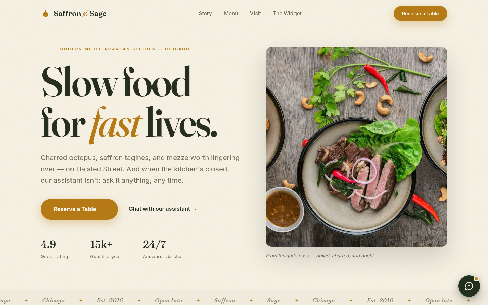
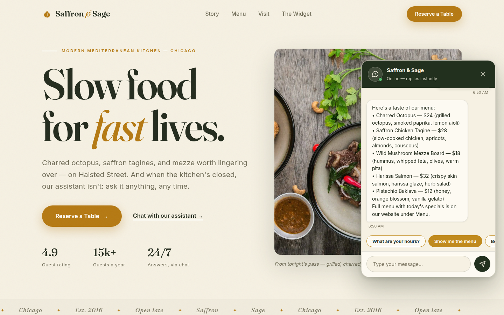
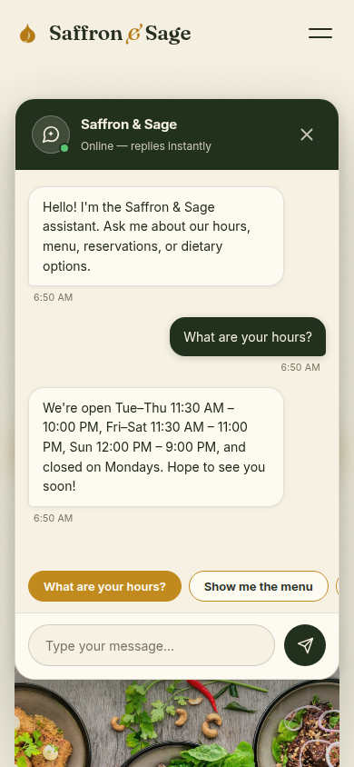

> **Live demo:** [https://saffron-sage-chat.vercel.app](https://saffron-sage-chat.vercel.app)



---

# AI Chat Widget — 24/7 Website Assistant

A floating chat widget any business can drop onto their website, powered by a
small Python backend that answers customer questions instantly — day or night.


## What it is

Answer customer questions 24/7, even while you sleep. The widget sits in the
corner of your website as a friendly chat bubble — visitors tap it and get
instant answers about your hours, location, menu, reservations, and dietary
options, instead of bouncing to a competitor. It handles the repetitive
questions so your staff can focus on the customers in front of them.

The demo is skinned for a fictional restaurant ("Saffron & Sage"), but the
same widget works for a coffee shop, salon, clinic, or any local business —
just swap the knowledge base and the accent color.



### Widget features

- **Custom launcher bubble** — inline SVG icon (never emoji), hover lift,
  unread-badge dot that nudges visitors who haven't opened the chat yet
- **Animated chat panel** — smooth open/close, messages slide in, animated
  typing-indicator dots while the reply loads
- **Quick-reply chips** — "Hours", "Menu", "Book a table" send on tap
- **Timestamps** on every message, auto-scroll, `Escape` to close,
  focus management and ARIA labeling throughout
- **Mobile sheet** — near-full-width panel at 390px, full-width-friendly input



## Tech used

- **Front end:** vanilla JavaScript + CSS (`static/chat-widget.js`,
  `static/chat-widget.css`) — no frameworks, no build step, ~20 KB total.
  Styled in an isolated `.cw-` namespace so it never clashes with the host
  site; themed with a single `accentColor` option.
- **Back end:** Python **Flask** (`flask`, `flask-cors`) with a `POST /api/chat`
  endpoint. The demo uses smart rule-based intent matching (keyword intents,
  a knowledge base, name memory, graceful fallbacks). The endpoint speaks
  plain JSON in/out, so it can be **swapped for a real LLM API
  (OpenAI, Anthropic, etc.) later without touching the widget**.
- **Demo page:** a full restaurant landing page (`templates/demo.html` +
  `static/demo.css` / `static/demo.js`) in its own warm-paper / deep-sage /
  saffron design language — semantic HTML, meta + OG tags, JSON-LD
  `Restaurant` schema, real food photography, scroll reveals, and an
  "Add to any site in 3 lines" embed section with a copy button.

## Intents covered (demo knowledge base)

Hours · Menu · Reservations · Dietary needs · Location & parking · Takeout ·
Prices · Contact · Greetings & small talk · Name memory ("my name is Alex") ·
Graceful fallback for anything unknown (never a dead end).

## How to run

```bash
cd 10-ai-chat-widget
pip install -r requirements.txt
python app.py
```

Then open **http://127.0.0.1:5057/demo** — you'll see the Saffron & Sage demo
site with the chat bubble in the bottom-right. Click it and try:

- "What are your hours?"
- "Show me the menu"
- "Do you have vegan options?"
- "My name is Alex" → then "thanks" (notice it remembers your name)
- Something it doesn't know, like "do you sell bicycles?" (graceful fallback)

## How to embed on any site

Add these **3 lines** before `</body>` on any page:

```html
<link rel="stylesheet" href="https://your-server/widget/chat-widget.css">
<script src="https://your-server/widget/chat-widget.js"></script>
<script>ChatWidget.init({ apiUrl: "https://your-server/api/chat" });</script>
```

Optional theming per site:

```html
<script>
  ChatWidget.init({
    apiUrl: "https://your-server/api/chat",
    businessName: "Saffron & Sage",
    accentColor: "#22301e",
    greeting: "Hi! Ask me about our hours, menu, or reservations."
  });
</script>
```

The returned instance exposes `open()`, `close()`, and `toggle()` if you want
to trigger the chat from your own buttons or links.

## API contract (for swapping in a real LLM later)

```
POST /api/chat
{ "message": "what are your hours?", "context": { "user_name": "Alex" } }

→ { "reply": "We're open …",
    "quick_replies": ["What are your hours?", "Show me the menu", "Book a table"],
    "context": { "user_name": "Alex" } }
```

Keep the same request/response shape and the widget keeps working — whether
the reply comes from rules, retrieval, or GPT.
